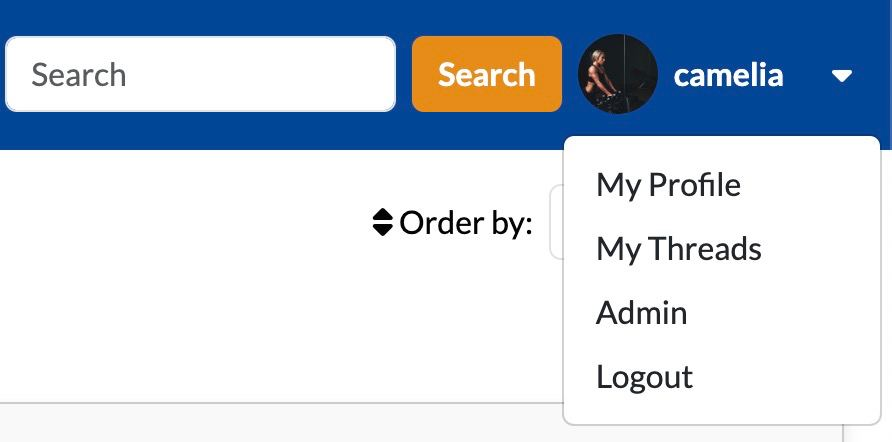
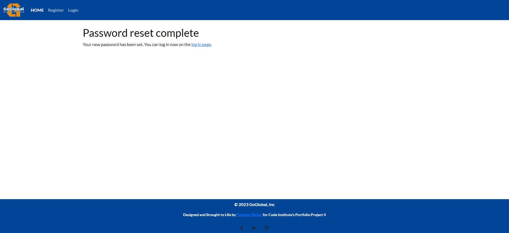
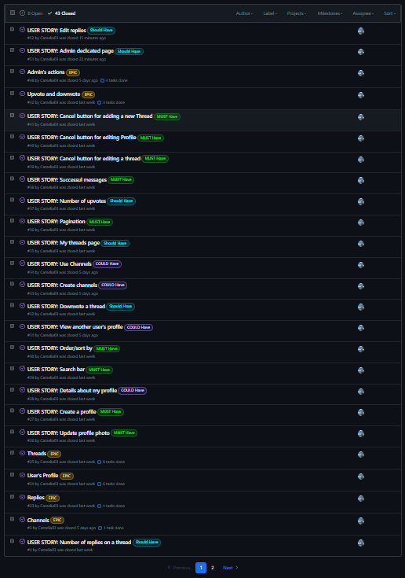

# GoGlobal

GoGlobal stands as a Django-based social media application that enables users to register, generate threads, browse through other user's threads or profile, establish connections with fellow users expressing appreciation through upvotes or downvotes and replies, but also enables to manage their own threads.

[View GoGlobal live](https://go-global-011c0a1d1612.herokuapp.com/)

## CONTENTS

* [User Experience (UX)](#User-Experience-UX)
  * [Initial Project](#Initial-Project)
  * [User Stories](#User-Stories)

* [Design](#Design)
  * [Color Scheme](#Color-Scheme)
  * [Typography](#Typography)
  * [Wireframes](#Wireframes)
  * [Features](#Features)

* [Technologies Used](#Technologies-Used)
  * [Languages Used](#Languages-Used)
  * [Frameworks, Libraries & Programs Used](#Frameworks,-Libraries-&-Programs-Used)

* [Database Design](#Database-Design)
  * [Relationship Diagram](#Relationship-Diagram)
  * [Models](#Models)

* [Agile Development Process](#Agile-Development-Process)
  * [GitHub Projects](#GitHub-Projects)
  * [GitHub Issues](#GitHub-Issues)
  * [Moscow Prioritization](#Moscow-Prioritization)

* [Testing](#Testing)

* [Deployment & Development](#Deployment--Development)
    * [Deploy on Heroku](#Deploy-on-Heroku)
     * [Database Setup](#Database-Setup)
    * [Development](#Development)

* [ Credits](#Credits)
    * [Code](#Code)
    * [Media](#Media)
    * [Acknowledgements](#Acknowledgements)

## User Experience UX

### Initial-Project

Starting off as a blogging platform, GoGLobal's main goal shifted towards creating a space where users could connect meaningfully. This involved enabling users to share their experiences, ask questions, and engage in threaded conversations. The underlying purpose was to facilitate a sense of staying connected, as encapsulated by the platform's slogan: *stay connected*.

### User Stories

|Epic ID| Epics        | User story ID |    LABELS     |User story                                                                                                      |
|:-----:|:-------------|:----:|:-----------------:|:-------------------------------------------------------------------------------------------------------------------:|
| 2 |User authentication|21|Must have|As a new user I can sign up and create an account so that I am able to establish my profile and commence using the platform       |
| 2 |User authentication|22|Must have|As a new user I can understand the site's purpose so that I can decide whether or not to sign up                                  |
| 2 |User authentication|20|Must have|As a registered user I can log in to my account so that I can access the site                                                     |
| 2 |User authentication|19|Must have|As a registered user I can log out of my account so that I can end my session on my current device                                |
| 2 |User authentication|18|Must have|As a registered user I can reset my password in case I forget it so that I can get access again to my account                     |
|24 |User's Profile     |27|Must have|As a registered user I can create a profile only by signing up so that I initiate my utilization of the site                      |
|24 |User's Profile     |26|Must have|As a registered user I can change my profile picture so that I am able to enhance my visibility and make it easier for fellow users to recognize me|
|24 |User's Profile     |28|Could have|As a registered user I can update/edit my profile showing my email address and an about me section so that other users can contact me by email or get to know me better|
|24 |User's Profile     |31|Must have|As a registered user, I can view another user's profile so that I can better understand their interests and activities, fostering a more connected and engaging community experience|
|24 |User's Profile     |35|Should have|As a registered user I can access a dedicated page for my threads so that I can conveniently view and manage all the content I've shared|
|24 |User's Profile     |40|Must have|As a registered user I can click on the cancel button while editing my profile so that I can undo the changes I've made and retain my previous profile information|
|25 |Threads            | 1|Must have|As a registered user I can click on a thread so that I can read the full-text                                                     |
|25 |Threads            | 6|Must have|As a registered user I can add a suggestive image to my thread so that I can suggest what my thread would be about                |
|25 |Threads            |15|Must have|As a registered user I can view a list of threads from other people so that I am able to select one to read                       |
|25 |Threads            |16|Must have|As a registered user I can delete my threads so that I remove content that I no longer wish to be published                       |
|25 |Threads            |17|Must have|As a registered user I can create new threads so that I share my thoughts                                                         |
|25 |Threads            |10|Must have|As a registered user I can see what time and date a thread was created so that I consider the whole context depending on its current age|
|25 |Threads            |39|Must have|As a registered user I can click on the cancel button while editing a thread so that I can discard the changes I've made and revert to the original thread content|
|25 |Threads            |41|Must have|As a registered user I can click on the cancel button while adding a new thread so that I can abandon the thread creation process and prevent the new thread from being added if I decide not to proceed with it|
|25 |Threads     |29|Must have|As a registered user I can search for other user's threads so that I can discover relevant content                               |
|25 |Threads     |30|Must have|As a registered user, I can select different sorting options so that I can customize the way I view the list of items and find the information I'm interested in more efficiently|
|42 |Upvote and downvote|11|Must have|As a registered user I can upvote other user's threads so that I let them know I enjoyed their thread                             |
|42 |Upvote and downvote|32|Should have|As a registered user I can downvote a thread so that I can express dissenting opinions and influence content assessment         |
|42 |Upvote and downvote|37|Should have|As a registered user I can view the total number of upvotes on a thread so that I can gauge its popularity and engagement       |
|23 |Replies            |13|Must have|As a registered user I can reply on other user's threads so that I engage with the user and open a conversation                   |
|23 |Replies            |12|Must have|As a registered user I can delete my replies so that I can remove what I no longer wish to be published                           |
|23 |Replies            |4|Should have|As a registered user I can see the number of replies on a thread so that I know the impact of my thread on other people          |
|23 |Replies            |52|Should have|As a registered user I can edit my replies so that I can change one of my previous replies.|
|23 |Replies             |5|Won't have|As a registered user I can use an emoji button when replying on a thread so that I can describe even better what I want to say   |
| 3 |Channels            |34|Could have|As a registered user I can utilize existing channels on the communication platform to read, post threads, and engage in conversations so that I can stay informed about diverse topics and contribute my insights and questions|
| 3 | Admin's action           |51|Should have|As an admin user I can access a dedicated page exclusively meant for administrators so that I can review a list of threadss that may require deletion or improved site organization|
|48 |Admin's action      |7|Could have|As an admin user I can suspend/delete the accounts of users who break the rules of the site so that I can prevent users from constantly violating the guidelines|
|48 |Admin's action      |8|Could have|As an admin user I can delete other user's threads so that I can update the site's content                                  |
|48 |Admin's action      |33|Could have|As an admin user I can create a new channel within the communication platform so that users can have a dedicated space to discuss project-related updates, share resources, and collaborate effectively|
|48 |Admin's action      |51|Should have|As an admin user I can access a dedicated page exclusively meant for administrators so that I can review a list of threadss that may require deletion or improved site organization|
|49 |Future features     |43|Won't have|As a registered user I can receive notifications for replies and upvotes/downvotes on my threads so that I stay updated on interactions and engagement with my content in the communication platform|
|49 |Future features     |44|Won't have|As a registered user I can follow other users on the platform so that I stay updated on their activities, threads, and contributions|
| 49 |Feature features            |45|Won't have|As a registered user I can join channels as a member so that I'll get access to discussions, information, and collaboration opportunities within the specific channel|
| 49 |Future features            |46|Won't have|As a registered user I can create personalized channels on the platform so that I can initiate discussions, share content, and connect with others who share similar interests|
| 49 | Future features           |47|Won't have|As a registered user I can be assigned roles within a channel so that I can moderate the channel's activities, ensuring smooth discussions, content curation, and maintaining a positive environment for all members|

## Design

### Color Scheme

- `#E58C18` used as a primary color for buttons.
- `#eca446` used for hovering primary-colored buttons.
- `#004696` used as a secondary color for buttons, for navigation and footer, but also for small details such as: signup/login links, edit thread button, and total number of threads in a channel.
- `#d2e4f9` used for hovering secondary colored buttons.
- `#f9f9f9` used for cards as a background-color.
- `#f9b1b1` used for the delete button.
- `#f8dddd` used for hover the delete button.

GoGlobal combines a range of colors that balance cool and warm tones, evoking a sense of harmony and diversity. 

The whites and light blues contribute to a fresh and airy feel, while the darker navy blue and the pop of orange add depth and visual interest. The light gray acts as a bridge, offering a subtle transition between the more vibrant and muted colors.

The colour palette was created using the [Coolors](https://coolors.co/) website.

The logo was created using the [LOGO](https://app.logo.com/) website.

### Typography

Google Fonts was used for the following fonts:

* Black Ops One is used for the logo of GoGlobal. It is sans-serif font.
* Lato is used for the body text on the website. It is a sans-serif font. 

- [Font Awesome](https://fontawesome.com) icons were used throughout the site, such as the social media icons in the footer, upvote and downvote button, replies and channels.

### Wireframes

I've used [Balsamiq](https://balsamiq.com/wireframes) to design my site wireframes for mobile and desktop.

### Sign In Page

View Sign In Page

#### Desktop

#### Mobile

### Sign Up Page

View Sign Up Page

#### Desktop

#### Mobile

### All threads Page

View All threads Page

#### Desktop

#### Mobile

### Channels Page

View Channels Page

#### Desktop

#### Mobile

### Add a new Thread Page

View Add a new Thread Page

#### Desktop

#### Mobile

### Edit Thread Page

View Edit thread Page

#### Desktop

#### Mobile

### Edit your Reply Page

View Edit reply Page

#### Desktop

#### Mobile

### My threads Page

View My threads Page

#### Desktop

#### Mobile

### Other user's profile Page

View Other user's profile Page

#### Desktop

#### Mobile

### Search Threads Page

View Search Threads Page

#### Desktop

#### Mobile

### Thread Details Page

View Thread Details Page

#### Desktop

#### Mobile

### My Profile Page

View My Profile Page

#### Desktop

#### Mobile

### Features

### Existing Features

- **Header and Navigation**

    - The navigation bar features a logo, the page's name, and links tailored for both unauthenticated and authenticated users. 
        - The nav bar contains everything the user will need to navigate the site. The site logo always appears on the site menu with the other items only showing for logged in users. 

        - For the unauthenticated users, the navbar only shows the authentication pages(Register, Login and Home-which brings them back to the landing page).

        - For authenticated users, the nav bar hides the authentication pages and shows only a search bar, a dropdown menu for user's profile and the logo. From the dropdown menu for user's profile, the user can go to their profile page(for editing their profile), to their threads(for editing or delete their threads) or to simply log out.

- **Default navbar for unregistered user**

    

- **Navbar for registered user**

    

- **Navbar on mobile**

    

- **Navbar expanded on mobile**

    

- **Navbar expanded dropdown menu**

    

- **Landing or Log In Page**

    - This page is where users arrive when they first visit the site or before they log in if they don't have an active session. It greets them and provides the choice to either create a new account or access an existing one.

      - Also here, users with accounts can log in using their username or email and password.
      - The page also provides a sign-up link for those looking to create an account. 
      - If a user forgets their password, there's a link to reset it.

    

- **Sign Up Page**

    - This is where users can set up an account by inputting their email, preferred username, and password (repeated for confirmation). If users arrive here unintentionally, instead of the login page, they can find their way to the appropriate page through the provided link.

    

- **Reset Password**

    - Users who forget their password can initiate a reset by entering the email they used for signing up. An email will be sent containing a link to establish a new password.

    

    

    

    

- **Footer**

    - The footer appears across the website and includes information about me as the developer with links to social media and GitHub pages. This lets the user get to know me as the developer and connect on these platforms if they wish.

    

- **Add Thread Form**

    - This is the space where users can generate their threads. It is accessible on both the home page and when selecting a channel from the sidebar. It requires you to choose a channel where you wish your thread to be, provide a title, write your content, and optionally include an image to better convey your message.

    

- **Channels**

    - This is the space where users can explore the channels feature, present on both the home page(for mobile) and the sidebar when navigating. It invites users to select a channel that best matches their discussion topic. This categorization enhances content organization and focuses discussions. Whether initiating a thread from the home page or within a selected channel, this feature ensures a smooth user experience, promoting relevant and engaging interactions.

  - **Channels-sidebar-desktop**
    

  - **Channels-homepage-mobile**

    

  - **Channels-expanded-desktop**

    

  - **Channels-expanded-mobile**

    

- **Order by**

    - This is where users can customize content organization on the home page and channels page. The "Order By" menu empowers users to personalize how content is displayed, ensuring a tailored browsing experience.
    
  - **Order-by-desktop**
    

  - **Order-by-mobile**

    

- **Pagination**

    - The pagination feature divides content into manageable segments of 5 items per page. This design ensures smoother navigation through extensive content, providing users with a more focused and comprehensible browsing experience.
    
    

- **Home Page**

    - Central to the site are user threads, showcased on the home page. Users can explore threads, choose channels, sort, and search. Essential thread data like reply count, upvotes, and downvotes are displayed under the "Read more" button for quick insights.

  - **Home Page-desktop**
    

  - **Home Page mobile**

    

- **My Profile Page**

    - My profile page presents a warm welcome message upon entry, along with the user's email address prominently displayed. Additionally, an "About Me" section offers insights about user's persona. To facilitate personalization, an "Edit Profile" button grants the authenticated user control over their displayed information.

    

- **Edit Profile**

    - The "Edit Profile" section provides a comprehensive form for users. It features fields for updating the username, selecting or modifying the profile image, and editing the "About Me" section. Users have the options to save their changes or cancel the process, conveniently accessible through corresponding buttons. Once changes are submitted, a success message confirms the successful update.

    

- **My threads Page**

    - The "My Threads" page offers users a consolidated view of all their threads. This page showcases relevant buttons such as "Read More," "Edit Thread," and "Delete Thread" for each entry. These buttons empower users to access the complete thread content, make edits, or remove threads as needed.

    

- **Read more/ Thread Details**

    - The "Read More" button directs users to the thread details page, offering an immersive experience. Here, users encounter the entire thread, enriched with context. The channel to which it belongs, its title, creation timestamp, author's name, and profile picture contribute to the comprehensive view. Additionally, the thread's associated image, content, but also the counted upvotes, and downvotes are prominently displayed.
    - To encourage engagement, a dedicated section enables users to leave a reply, fostering dynamic discussions.Following this, a "Replies" section presents the users's names and their replies, creating a comprehensive space for discussions. 

 - **Read more/ Thread Details Page**
    

  - **Thread Details Page- replies section**
  
    

- **Edit Thread Page**

    - "Edit Thread" presents a form for modifying threads. Users can choose a new channel, change the title, content, and image. The options to save or cancel changes are presented through buttons. Upon submitting changes, a success message confirms the update's completion.

    

- **Delete Thread**

    - Users can delete their threads by clicking the delete button. A confirmation window appears to prevent accidental deletions. If users change their minds, a button takes them back to the thread. For thread deletions, a successful action message is displayed after the process is completed.

    

- **Replies**

    - Replies appear beneath threads. The replies authors and threads authors have the ability to delete their replies, while replies authors can edit their replies as well. 

    

- **Edit reply**

    - Reply authors can edit their replies. Clicking the edit icon takes them to a page where they can make changes and save. If they edit by mistake, a button brings them back to the thread.

    

- **Delete reply**

    - The replies can be deleted by both the reply's author or the thread's author using the delete icon. To prevent accidental deletions, a confirmation page appears. Users can return to the thread they replied on using a button if they change their mind about deleting the reply.

    

- **Other user's Profile**

    - Clicking the thread author's name reveals their profile. This page shows their name, email, and "About Me" section for better communication. You can also view their threads with full details on their profile.

    

- **Search**

    - The search bar empowers users to quickly find what they're looking for. It allows users to enter keywords or phrases, and it expertly guides them to threads that match their interests. 

    

    Even if no results are found for a specific keyword, the search bar ensures the user informed, allowing them to refine their search or explore other topics.

    

- **Logout**

    - To conclude their session and log out, users can do so conveniently from the My Profile dropdown menu.

    

- **Admin Panel**

    - The admin panel is exclusively accessible via Django's backend by adding "/admin" to the end of the website's URL. Admins hold the authority to determine whether a thread should be deleted.

    

- **Error Pages**

    - If a user reaches a page that doesn't exist or isn't allowed (like a regular user trying to access the admin panel or deleting others' threads), they'll see an error page. It has a button to take them back to home page.

    

    

    

    

### Future Features

- Reply to a reply
    - Registered users will have the ability to respond to replies on the communication platform. This empowers them to actively participate in discussions, express their viewpoints, and engage with others within the community.

- Emoji button
    - Registered users will be able to utilize an emoji button while replying to threads. This allows them to convey their thoughts more vividly and accurately.

- Notifications
    - Registered users will be able to receive notifications for replies, upvotes, and downvotes on their threads. This keeps them informed about interactions and engagement with their content within the communication platform.

- Follow other users
    - Registered users will have the option to follow other users on the platform. This ensures they receive updates about their activities, threads, and contributions.

- Join channels as a member
    - Registered users will have the ability to join channels as members. This grants them access to discussions, information, and opportunities for collaboration within the chosen channel.

- Roles within a channel
    - Registered users will have the capability to be assigned specific roles within a channel. This feature empowers users to take on moderation responsibilities, ensuring the channel's activities run smoothly. 

- Allow users to create their own channels
    - Registered users will be able to create personalized channels on the platform. This enables them to start discussions, share content, and connect with like-minded individuals who have similar interests.

## Technologies-Used

### Languages-Used

 - HTML is utilized as the primary language to establish the website's structural framework.
 - CSS is employed to tailor the visual style of the website.
 - JavaScript is leveraged for modifying the DOM across different pages.
 - Python plays a pivotal role in configuring the site's fundamental functionalities, including models and views.

### Frameworks,-Libraries-&-Programs-Used:
- Python Modules/Packages-Used:

This project relies on several core packages, with some key ones highlighted along with their functions:

 - django: A high-level Python web framework used for developing this application/site.
 - crispy-bootstrap5: A Bootstrap 5 template pack designed for django-crispy-forms.
 - dj3-cloudinary-storage: This package simplifies integration with Cloudinary by implementing Django Storage API.
 - django-allauth: An integrated set of Django applications designed for authentication, registration, account management, and third-party (social) account authentication.
 - django-crispy-forms: Offers a crispy filter and `` tag for elegant and DRY (Don't Repeat Yourself) rendering of Django forms.
 - psycopg2: An adapter for the Python programming language that facilitates interaction with PostgreSQL databases.
 - coverage: This package generates a coverage report for automated testing, aiding in testing effectiveness assessment.

- Frameworks & Tools

Here's a rundown of the key tools and platforms utilized in this project:

 - Django: Employed for establishing the website's backend logic and user model.
 - Bootstrap: Woven into the site's fabric, it contributes to responsiveness, layout, and predefined style elements.
 - CodeAnywhere: Utilized for coding and development tasks, including writing, committing, and pushing code to GitHub.
 - GitHub: Serves as the host for the website's source code. It also records the Agile development framework implementation, incorporating issues, milestones, and projects.
 - ElephantSQL: Used as the Postgres database.
 - Heroku: Used for deploying the live version of the website.
 - Cloudinary: Acts as a cloud storage solution for website media and static files. It also offers media manipulation and optimization features.
 - Balsamiq: Chosen for creating project wireframes.
 - Gmail: used to create an email address to send password reset emails from.
 - Google Dev Tools - to troubleshoot and test features, solve issues with responsiveness and styling.
 - [Am I Responsive?](http://ami.responsivedesign.is/) - to show the website image on a range of devices.
 - Google Fonts: Imports fonts to enhance the website's typography.
 - Font Awesome: Provides the necessary icons across the site.
 - LOGO: Provides the necessary official logo across the site.
 - Coolors: Provides the color palette across the site.

## Database Design
By creating an entity relationship diagram, I gained a clear picture of how my data structures interconnect. This approach greatly facilitated the development process by providing a consolidated reference point, sparing me the need to navigate through individual models.py files for guidance.

### Relationship Diagram

To create the databse diagram, I used [PyCharm](https://www.jetbrains.com/pycharm/) which helped me generate it automatically.

 ### Models

The following are the models created for GoGlobal.

- **Allauth User Model**
    - The User model was built using [Django's Allauth library](https://django-allauth.readthedocs.io/en/latest/overview.html)
    - When a user is created, they're automatically assigned a profile through the Profile model.

- **Profile**

    | **Field** | Type | Notes |
    | --------- | ---- | ----- |
    |  id | Integer | PK |
    | user | OneToOne | FK to **User** model |
    | about | TextField | |
    | avatar | CloudinaryField | |

- **Thread**

    | **Field** | Type | Notes |
    | --------- | ---- | ----- |
    |  id    | Integer | PK |
    | user | ForeignKey | FK to **User** model |
    | title | CharField |  |
    | content | TextField | |
    | created_on | DateTimeField | |
    | image | CloudinaryField | |
    | edited_on | DateTimeField | |
    | channel | ForeignKey | FK to **Channel** model |

- **Reply**

    | **Field** | Type | Notes |
    | --------- | ---- | ----- |
    |  id    | Integer | PK |
    | thread | ForeignKey | FK to **Thread** model |
    | user | ForeignKey   | FK to **User** model   |
    | content | TextField | 
    | created_on | DateTimeField |  

- **Upvote**

    | **Field** | Type | Notes |
    | --------- | ---- | ----- | 
    |  id    | Integer | PK |
    | thread | ForeignKey | FK to **Thread** model |
    | user | ForeignKey   | FK to **User** model   |
    | created_on | DateTimeField |  

    - unique constraint on **thread** and **user**

- **Downvote**

    | **Field** | Type | Notes |
    | --------- | ---- | ----- |
    |  id    | Integer | PK | 
    | thread | ForeignKey | FK to **Thread** model |
    | user | ForeignKey   | FK to **User** model   |
    | created_on | DateTimeField |  

    - unique constraint on **thread** and **user**

- **Channels**

    | **Field** | Type | Notes |
    | --------- | ---- | ----- |
    |  id    | Integer | PK |
    | name | CharField |  
    | image | CloudinaryField | 
    | icon | CharField |  
    | slug | SlugField |  

## Agile Development Process

### GitHub Projects
 The project's development was coordinated using GitHub's issues, milestones, and projects features. [GitHub Projects](https://github.com/Camelia03/portofolio-project-4/projects) served as an Agile tool, adapted effectively with appropriate tags and issue assignments.

This approach utilized user stories and a basic Kanban board. It helped me manage tasks, track progress, and smoothly move through development, testing, and completion phases.

### GitHub Issues

GitHub Issues served as an additional Agile tool. Within this context, I utilized my own User Story Template to manage user stories. To enhance issue organization and streamline workflows, I created an "EPIC" tag for effectively categorizing and addressing issues on the site.

- [Epics](https://github.com/users/Camelia03/projects/6/views/2)
    

- [Open Issues](https://github.com/Camelia03/portofolio-project-4/issues)

    

- [Closed Issues](https://github.com/Camelia03/portofolio-project-4/issues?q=is%3Aissue+is%3Aclosed)

    
    

### MoSCoW Prioritization

Before implementing my Epics, I broke them down into individual stories.
By following this method, I could then apply MoSCoW prioritization and labels for my user stories directly in the Issues tab.

|                  |       |      |      |
| ---------------- | ----- | ---- | ---- |
|  **Must Have** | *max 60% of stories* | guaranteed to be delivered | These are the core features that are vital for the initial release.|
|  **Should Have** | *aprox.20% of stories* | adds significant value, but not vital | These features are important and should be prioritized, but the project can proceed without them.|
|  **Could Have** | *20% of stories* | has small impact if left out | These features provide added value and are desirable, but they are not essential for the current release.|
|  **Won't Have** |  | not a priority | These are features that have been deliberately deferred to a later phase or release.|

## Testing

The testing documentation can be found at [TESTING.md](TESTING.md).

## Deployment & Development

### Deploy on Heroku

**Creating a Heroku App**

- Log into Heroku and access the Dashboard.
- Click "New" and select "Create new app".
- Give the app a name and choose the closest region.
- Confirm by clicking "Create app".

**Requirement and Procfile Setup**
Heroku needs two additional files in order to deploy properly.
- requirements.txt
- Procfile

- If you have your own packages that have been installed, then the requirements file needs updated using:
 `pip3 freeze --local > requirements.txt`

- Creating the Procfile is as simple as using this command:
 `echo web: gunicorn app_name.wsgi > Procfile`
- Remember to replace *app_name* with your primary Django app's name; the one where settings.py is located.

For deploying on Heroku, follow these steps to connect your GitHub repository with the new app:

**Option 1:**
Choose *Automatic Deployment* within the Heroku app interface.

**Option 2:**

- Open Terminal/CLI and connect to Heroku: heroku login -i
- Set the Heroku remote: heroku git:remote -a app_name (replace app_name with your app's name)
- After standard Git commands like add, commit, and push to GitHub, use:
`git push heroku main`
- Your project is now connected and deployed on Heroku!

**Setting Environment Variables**

 - Select the app and navigate to the "Settings" tab on the Heroku Dashboard.
 - Click the "Reveal Config Vars" button
 - Add the following config vars: 

`DATABASE_URL - copy the database URL from ElephantSQL and env.py.`

`SECRET_KEY - paste your secret key. `

- If using Cloudinary storage, add your CLOUDINARY_URL here, followed by CLOUDINARY_API_KEY, CLOUDINARY_API_SECRET and CLOUDINARY_CLOUD_NAME.

- You may also need the key PORT with value 8000.

- For email features you may need also the EMAIL_HOST_USER and EMAIL_HOST_PASSWORD keys here.

**Connecting to GitHub and Deployment**

 - On Heroku Dashboard, select the app and go to the "Deploy" tab.
 - Choose GitHub for deployment method.
 - Search and connect to your project repository.
 - Opt for "Enable Automatic Deploys" if desired.
 - Deploy your app by selecting "Deploy Branch" to observe the app building.

### Database Setup

- Log into ElephantSQL.com and access your dashboard.
- Click "Create New Instance".
- Configure a plan, set a Name, choose the Tiny Turtle (Free) plan, and leave the Tags field empty.
- Pick a data center near you under "Select Region".
- Review your settings and click "Create instance".
- Return to the ElephantSQL dashboard and click on the instance name for your project.
- In the URL section, click the copy icon to copy the database URL.
- In your workspace, ensure you have Django and Gunicorn installed using `pip3 install 'django<4' gunicorn`
- Also, make sure to install infrastructure for the database with `pip3 install dj_database_url===0.5.0 psycopg2`
- Update the requirements.txt file if necessary.

### Development

**Local Clone**

1. Log in to GitHub and find the repository you wish to clone.
2. Locate the Code button above the list of files and click it 
3. Select if you prefer to clone using HTTPS, SSH, or GitHub CLI and click the copy button to copy the URL to your clipboard
4. Launch Git Bash within your IDE.
5. Navigate to the desired directory using the CLI.
6. Enter `git clone` followed by the copied URL. For example:
`$ git clone https://github.com/`
7. Press Enter to initiate the local clone.

Don't forget to install all the packages specified in the requirements file. This can be achieved by using the following terminal command: `pip install -r requirements.txt` This command automatically installs the required packages for you.

### Credits
## Code
While working on the project, I frequently referred to the following websites for troubleshooting:  

- [W3 Schools](https://www.w3schools.com)
- [Stack Overflow](https://stackoverflow.com)
- [MDN web docs](https://developer.mozilla.org)
- [Django documentation](https://docs.djangoproject.com/en/4.2/)

- [Dev Handbook](https://www.devhandbook.com/django/user-profile/) - for creating a user profile that extends Django's User model

- [Code Institute](https://learn.codeinstitute.net/courses/course-v1:CodeInstitute+EA101+2021_T1/courseware/eb05f06e62c64ac89823cc956fcd8191/39dfbd4ba6ac42168b5df88d69c32f02/)- for password reset email

- [Code Institute](https://learn.codeinstitute.net/courses/course-v1:CodeInstitute+FST101+2021_T1/courseware/b31493372e764469823578613d11036b/c6a89f138afe4b209ee4fa6d6f1251a3/?child=first) - for pagination & inbox layout 

- [Django Docs](https://docs.djangoproject.com/en/4.1/topics/auth/default/) - for only logged in users can access main site

- [Django Docs](https://learndjango.com/tutorials/django-password-reset-tutorial) - for password reset tutorial

- [Django Docs](https://learndjango.com/tutorials/django-login-and-logout-tutorial) - for the login and logout tutorial

- [Dev Community](https://dev.to/earthcomfy/django-user-profile-3hik) - for user profile

- [Geeks for Geeks](https://www.geeksforgeeks.org/django-templates/?ref=lbp) - for django templates

- [Abstractapi](https://www.abstractapi.com/guides/django-send-email#:~:text=In%20order%20to%20send%20emails,and%20generate%20an%20app%20password) - how to send email with Django

## Media

All media files on the webiste, except one, were taken from [Pixabay](https://pixabay.com/)

The image from the *Q&As* Channel was taken from [Pexels](pexels.com)

To create a favicon I used [Favicon](https://favicon.io/)

Throughout the site, I used icons, such as the social media icons in the footer, upvote and downvote button, replies and channels from [Font Awesome](https://fontawesome.com).

## Acknowledgements

- I extend my gratitude to my mentor Jubril Akolade, whose feedback, advice, guidance, and support significantly enriched this project and the preceding three.
- The Code Institute Slack community deserves recognition for providing unwavering encouragement during moments of self-doubt and imposter syndrome.
- A heartfelt thanks to my parents for their constant encouragement and support throughout this journey.
- The tutors at tutor support, though rarely contacted during this project, consistently showcased swift and effective resolution of issues when needed.
- Lastly, I appreciate my husband, Mihai, for his continuous support and unwavering belief throughout the course and project journey.