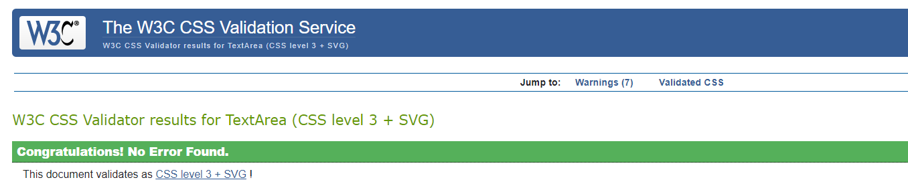
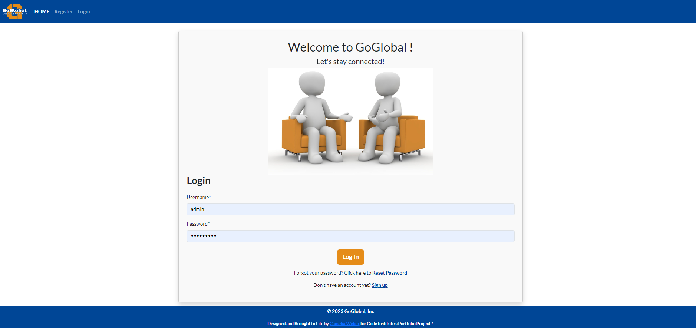
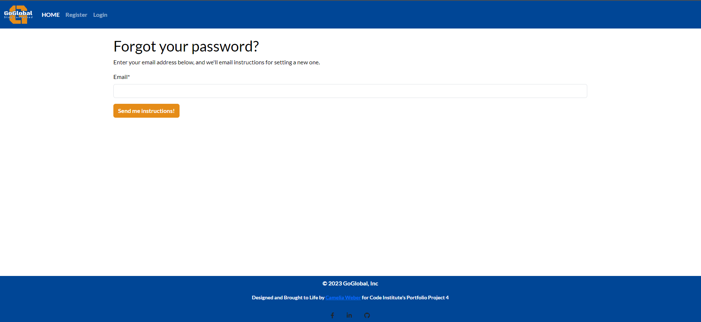
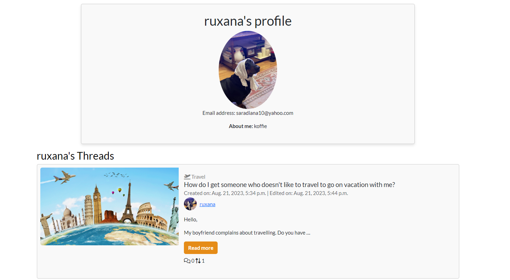
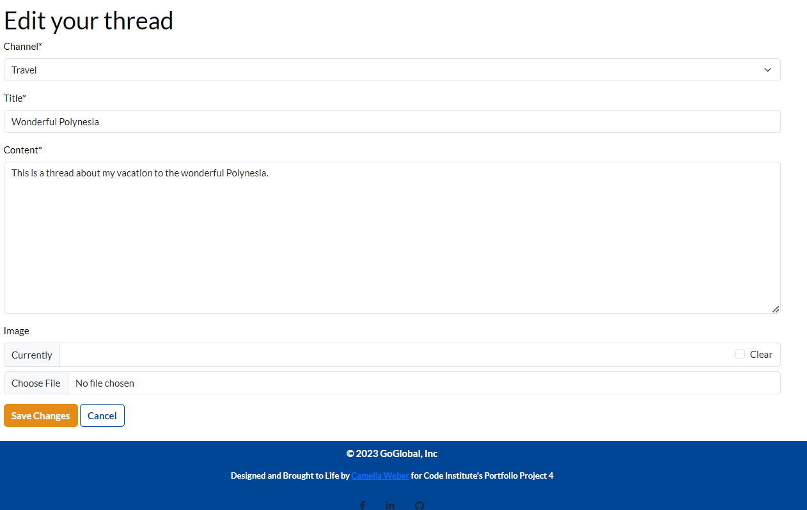

# Testing

Return back to the [README.md](README.md) file.

## CONTENTS

* [AUTOMATED TESTING](#AUTOMATED-TESTING)
  * [W3C Validator](#W3C-Validator)
  * [Jigsaw Validator](#Jigsaw-Validator)
  * [JavaScript Validator](#JS-Validator)
  * [Python Validator](#Python-Validator)
  * [Lighthouse](#Lighthouse)
  * [Python-Unit testing](#Python-Unit-testing)

* [MANUAL TESTING](#MANUAL-TESTING)
  * [Testing User Stories](#Testing-User-Stories)
  * [Test cases](#Test-cases)

* [BUGS](#BUGS)

## AUTOMATED TESTING

### W3C Validator
The [W3C Markup Validation Service](https://validator.w3.org/) was used to validate the HTML of the website.

**HTML results:**

The following pages were tested and no errors were detected on any of the pages:

[Home Page W3C HTML Validation](https://validator.w3.org/nu/?doc=https%3A%2F%2Ffoundintranslationsodaci.herokuapp.com%2F)

Validation Passed

- - -

[Log In W3C HTML Validation](https://validator.w3.org/nu/?showsource=yes&doc=https%3A%2F%2Fgo-global-011c0a1d1612.herokuapp.com%2Faccounts%2Flogin%2F%3Fnext%3D%2F)

Validation Passed

- - -

[Sign Up W3C HTML Validation](https://validator.w3.org/nu/?showsource=yes&doc=https%3A%2F%2Fgo-global-011c0a1d1612.herokuapp.com%2Fforum%2Fsignup)

Validation Passed

- - -

[Reset Password V3C HTML Validation](https://validator.w3.org/nu/?showsource=yes&doc=https%3A%2F%2Fgo-global-011c0a1d1612.herokuapp.com%2Faccounts%2Fpassword_reset%2F)

Validation Passed

- - -

[Add thread V3C HTML Validation]()

Validation Passed

- - -

[Channels V3C HTML Validation]()

Validation Passed

- - -

[Edit Profile V3C HTML Validation]()

Validation Passe

- - -

[Edit thread V3C HTML Validation]()

Validation Passed

- - -

[My Profile V3C HTML Validation]()

Validation Passed

- - -

[My threads V3C HTML Validation]()

Validation Passed

- - -

[Order By V3C HTML Validation]()

Validation Passed

- - -

[Search V3C HTML Validation]()

Validation Passed

- - -

### Jigsaw Validator
The [W3C Jigsaw CSS Validation Service](https://jigsaw.w3.org/css-validator/) was used to validate the CSS of the website.

 **CSS Validation**

The testing of the `style.css` file resulted in the following outcome:

[W3C Jigsaw CSS Validation]()

Validation Passed

- - -

### JS Validator

[JSHint](https://jshint.com/) was used to validate the JavaScript of the website.

[JSHint Validation]()

index.js - Validation Passed

- - -

[JSHint Validation]()

user_threads.js - Validation Passed

### Python Validator

I have used the recommended [CI Python Linter](https://pep8ci.herokuapp.com) to validate all of my Python files.

forms.py

- - -

models.py

- - -

signals.py

- - -

tests.py

- - -

urls.py (main)

- - -

views.py

- - -

settings.py

- - -

urls.py

- - -

### Lighthouse

I used [Google Lighthouse](https://developer.chrome.com/docs/lighthouse/overview/) to test the performance of the website. 

| Page | Size | Screenshot |
| :----: | :----: | :-----------------------: |
| Home | Desktop |  |
| Home | Mobile |  |
| Sign Up | Desktop |  |
| Sign Up | Mobile |  |
| Sign In | Desktop |  |
| Sign In | Mobile |  |
| Forgot Password | Desktop |  |
| Forgot Password | Mobile |  |
| Add a Thread | Desktop |  |
| Add a Thread | Mobile |  |
| Thread Details | Desktop |  |
| Thread Details | Mobile |  |
| My Profile | Desktop |  |
| My Profile | Mobile |  |
| Edit Profile | Desktop |  |
| Edit Profile | Mobile |  |
| My Threads | Desktop |  |
| My Threads | Mobile |  |
| Edit Threads | Desktop |  |
| Edit Threads | Mobile |  |
| Other user's Profile | Desktop |  |
| Other user's Profile | Mobile |  |
| Search | Desktop |  |
| Search | Mobile |  |
| Order by | Desktop |  |
| Order by | Mobile |  |
| Channels | Desktop |  |
| Channels | Mobile |  |

### Python (Unit Testing)

- To assess the functionality of the application, I utilized Django's built-in unit testing framework.

For test execution, I used the following terminal command:

`python3 manage.py test`

## MANUAL TESTING

### Testing User Stories

Below are user stories I've executed, accompanied by screenshots as evidence.

`First Time Visitors`

As a new user I can understand the site's purpose so that I can decide whether or not to sign up

- - -

As a new user I can sign up and create an account so that I am able to establish my profile and commence using the platform

- - -

`Registered/Returning Visitors`

As a registered user I can log in to my account so that I can access the site

- - -

As a registered user I can log out of my account so that I can end my session on my current device

- - -

As a registered user I can reset my password in case I forget it so that I can get access again to my account

- - -

As a registered user I can create a profile only by signing up so that I initiate my utilization of the site

- - -

As a registered user I can change my profile picture so that I am able to enhance my visibility and make it easier for fellow users to recognize me

- - -

As a registered user I can update/edit my profile showing my email address and an about me section so that other users can contact me by email or get to know me better

- - -

As a registered user I can click on the cancel button while editing my profile so that I can undo the changes I've made and retain my previous profile information

- - -

As a registered user, I can view another user's profile so that I can better understand their interests and activities, fostering a more connected and engaging community experience

- - -

As a registered user I can access a dedicated page for my threads so that I can conveniently view and manage all the content I've shared

- - -

As a registered user I can click on the cancel button while editing a thread so that I can discard the changes I've made and revert to the original thread content

- - -

As a registered user I can delete my threads so that I remove content that I no longer wish to be published

- - -

As a registered user I can add a suggestive image to my thread so that I can suggest what my thread would be about

- - -

As a registered user I can click on a thread so that I can read the full-text

- - -

As a registered user I can view a list of threads from other people so that I am able to select one to read

- - -

As a registered user I can create new threads so that I share my thoughts

- - -

As a registered user I can see what time and date a thread was created so that I consider reading the whole context depending on its current age

- - -

As a registered user I can click on the cancel button while adding a new thread so that I can abandon the thread creation process and prevent the new thread from being added if I decide not to proceed with it

- - -

As a registered user I can upvote other user's threads so that I let them know I enjoyed their thread

- - -

As a registered user I can downvote a thread so that I can express dissenting opinions and influence content assessment

- - -

As a registered user I can view the total number of upvotes on a thread so that I can gauge its popularity and engagement

- - -

As a registered user I can reply on other user's threads so that I engage with the user and open a conversation

- - -

As a registered user I can delete my replies so that I can remove what I no longer wish to be published

- - -

As a registered user I can see the number of replies on a thread so that I know the impact of my thread on other people

- - -

As a registered user I can respond to replies on the communication platform so that I can engage in discussions, share my perspective, and interact with others in the community

- - -

As a registered user I can utilize existing channels on the communication platform to read, post threads, and engage in conversations so that I can stay informed about diverse topics and contribute my insights and questions

- - -

As a registered user I can search for other user's threads so that I can discover relevant content

- - -

As a registered user, I can select different sorting options so that I can customize the way I view the list of items and find the information I'm interested in more efficiently

### MoSCoW prioritization

Listed below are **user stories** that I couldn't successfully implement, designated as "Won't Have" in my ***MoSCoW*** prioritization.

As a registered user I can use an emoji button when replying on a thread so that I can describe even better what I want to say

![screenshot]N/A

- - -

As a registered user I can receive notifications for replies and upvotes/downvotes on my threads so that I stay updated on interactions and engagement with my content in the communication platform

![screenshot]N/A

- - -

As a registered user I can follow other users on the platform so that I stay updated on their activities, threads, and contributions

![screenshot]N/A

- - -

As a registered user I can join channels as a member so that I'll get access to discussions, information, and collaboration opportunities within the specific channel

![screenshot]N/A

- - -

As a registered user I can create personalized channels on the platform so that I can initiate discussions, share content, and connect with others who share similar interests

![screenshot]N/A

- - -

As a registered user I can be assigned roles within a channel so that I can moderate the channel's activities, ensuring smooth discussions, content curation, and maintaining a positive environment for all members

![screenshot]N/A

- - -

`Admin User`

As an admin user I can suspend/delete the accounts of users who break the rules of the site so that I can prevent users from constantly violating the guidelines

![screenshot]N/A

- - -

As an admin user I can delete other user's threads so that I can update the site's content

![screenshot]N/A

- - -

As an admin user I can create a new channel within the communication platform so that users can have a dedicated space to discuss project-related updates, share resources, and collaborate effectively

![screenshot]N/A

- - -

As an admin user I can access a dedicated page exclusively meant for administrators so that I can review a list of posts that may require deletion or improved site organization

![screenshot]N/A

- - -

### Test cases

Feature | Expected Outcome | Testing Performed | Result | Pass/Fail |
| --- | --- | --- | --- | --- |
| `Navbar` |
| Site logo | Redirects to the home page | Click logo |  Redirects to home page | Pass |
| Home Link | Redirects to home page | Click home link | Redirects to home page | Pass |
| Login Link (user not logged in) | Redirect to Login page | Click log in link | Redirected to log in page | Pass |
| Sign up Link (user not logged in)  | Redirect to Sign up page | Click sign up link | Redirected to sign up page | Pass |
| Admin View | Redirects to the admin view page | url + `/admin` | Redirected to admin view page | Pass |
| Logout link (user logged in) | User will be logged out | Click log out link| Redirected to login page | Pass |
| `Login Page` |
| Form - link to sign up page | Redirects user to sign in page | Click link | Redirected to sign up page | Pass |
| Form - Submission with no information | User prompted to fill in information | clicked submit button with no fields filled out | Form highlighted first empty field | Pass |
| `Signup Page` |
| Form - Submission with no information | User prompted to fill in information | clicked submit button with no fields filled out | Form highlighted first empty field | Pass |
| `Home Page` |
| View threads button | Redirects to the threads page | Click button | Redirected to the thread | Pass |
| Add a new thread button | Redirects to the form to create new thread | Click button | Redirected to create a new thread | Pass |
| Channels Link | Redirects to one of the channels page | Click button | Redirected to the channels page | Pass |
| Search button | User prompted to fill in a keyword | Click button | Redirected to the results page | Pass |
| Order by dropdown button | User prompted to select an option | Click button | Redirected to the home page with ordered threads | Pass |
| `My Profile Page` |
| My Profile Link | Redirects to the (logged in) user's profile page | Click button | Redirected to the user's profile page | Pass |
| Edit Profile button | Redirects to edit form for user's profile page | Click button | Redirected to the edit user's profile page | Pass |
| `My Threads Page` |
| My Threads Link | Redirects to the (logged in) user's threads page | Click button | Redirected to the user's threads page | Pass |
| Read more button | Redirects to the (logged in) user's thread details page | Click button | Redirected to the user's thread details page | Pass |
| Edit button | Redirects to the (logged in) user's existing thread form to edit page | Click button | Redirected to the user's existing thread form page | Pass |
| Delete button | Modal popup to delete thread | Click button | Redirected to the (logged in) user's thread page | Pass |
| `Channels Page` |
| A channel Link | Redirects to the (selected) channel page | Click button | Redirected to (selected) channel page | Pass |
| `Upvote button` |
| Upvote button | Increases the number of upvotes | Click button | Increased the number of upvotes | Pass |
| `Downvote button` |
| Dowvote button | Decreases the number of upvotes | Click button | Decreased the number of upvotes | Pass |
| `Replies` |
| Submit button | Submits the content wrote as a reply | Click button | Submitted the content wrote as a reply | Pass |
| `Other user's Profile Page` |
| Other user's Profile Link | Redirects to the (selected) user's profile page | Click button | Redirected to the (selected) user's profile page | Pass |
| `404 Page` |
| (User Logged in) Home Button | User will be redirected to the home page | Click home button | Redirected to the home page | Pass |
| (Guest User) Login Button | User redirected to the login page | Click login button | Redirected to the login page | Pass |
| (Guest User) Sign Up Button | User redirected to the sign up page | Click sign up button | Redirected to sign up page | Pass |
| `Footer` |
| Camelia Weber link | Redirects user to the developer's GitHub page | Click link | Redirected to developer's GitHub page | Pass |
| Footer - Social media links | Opens new tab to the social media site | Clicked each icon | New tabs opened for each site | Pass |

## Bugs

1. Tried adding the user field to a thread - However, I could not make a migration because the existing threads could not have a null user
    - Fixed by setting a default user to all existing threads
2. There was no success message after adding a new thread
    - Fixed by using Django's built in messages system by showing them after any successful action
3. On register page - Email field should not be the last one
    - Fixed by changing the order of the fields in the form class
4. There was a `div` inside an `a` tag in the my account dropdown navigation
    - Fixed by converting the a in a div and convert to a Bootstrap dropdown
5. After sorting threads by most popular, the pagination was breaking the sort.
    - Fixed by making sure the order_by query parameter was preserved in the url when chaning the page
6. The application would crash if no search keyword was given
    - Fixed by checking if the keyword is set and if not return an empty list(Error 500)
7. The application would crash if the user try to create a thread with a channel that did not exist(Error 500)
    - Fixed by checking if the channel exists, if not showing the 404 error
8. The success message is not shown after registering
    - Fixed by setting a success message and showing it in the template using the Django messages feature

- - -

Back to [README.md](README.md)