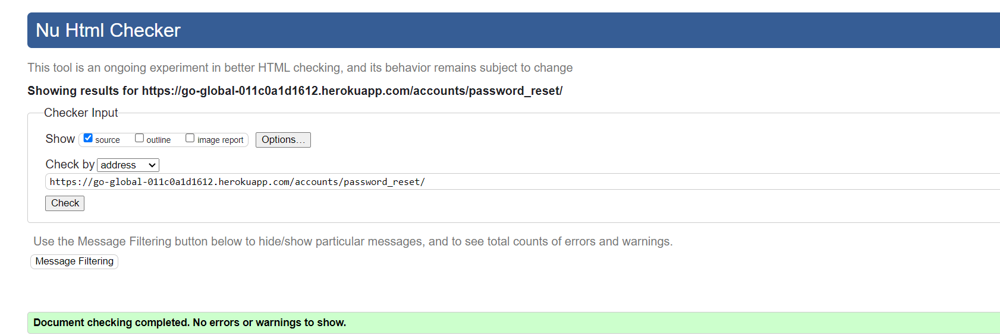
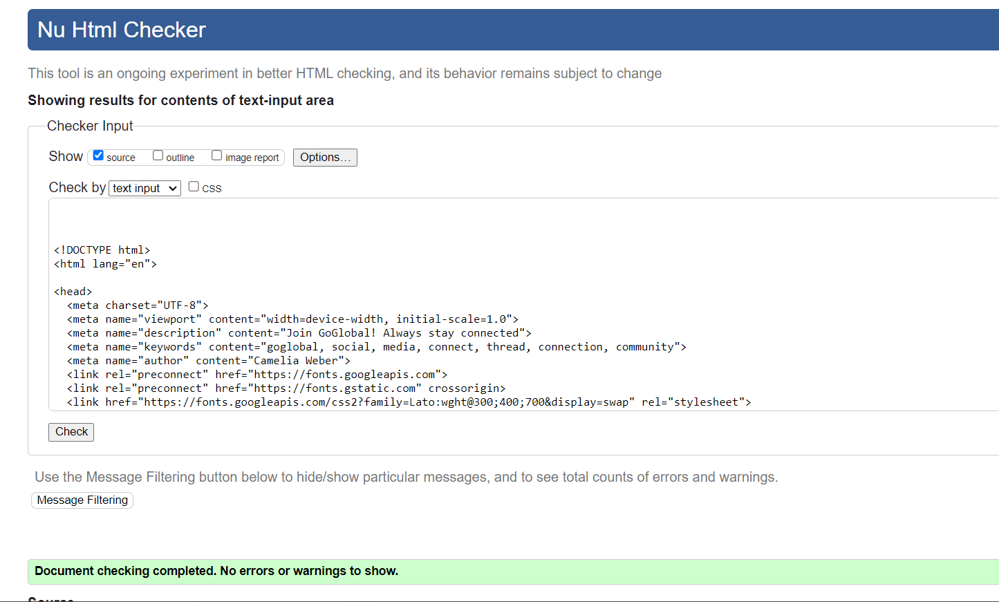
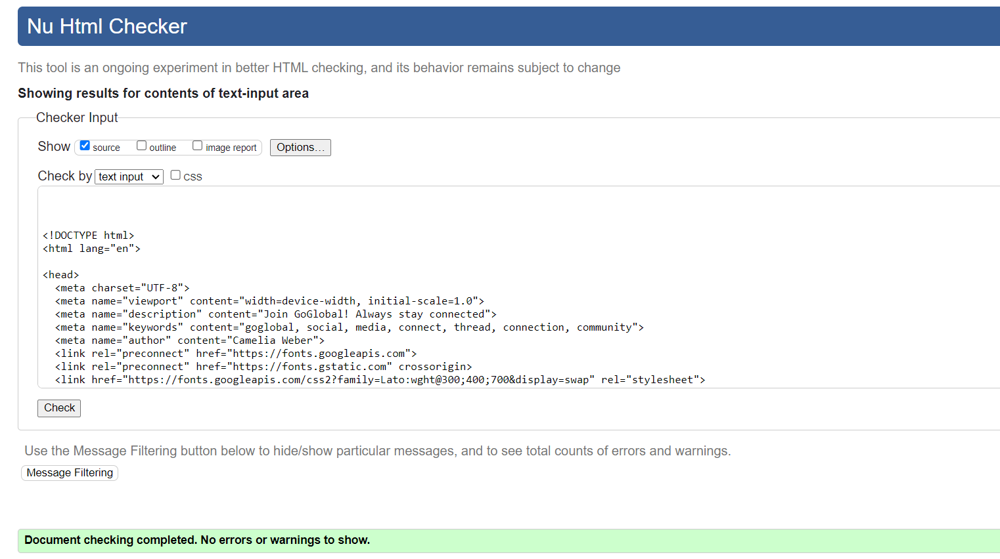
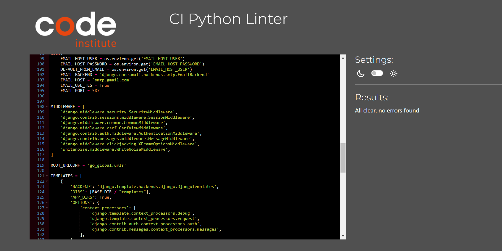

# Testing

Return back to the [README.md](README.md) file.

## CONTENTS

* [AUTOMATED TESTING](#AUTOMATED-TESTING)
  * [W3C Validator](#W3C-Validator)
  * [Jigsaw Validator](#Jigsaw-Validator)
  * [JavaScript Validator](#JS-Validator)
  * [Python Validator](#Python-Validator)
  * [Lighthouse](#Lighthouse)

- - -

## AUTOMATED TESTING

### W3C Validator
The [W3C Markup Validation Service](https://validator.w3.org/) was used to validate the HTML of the website.

**HTML results:**

The following pages were tested and no errors were detected on any of the pages:

[Home Page W3C HTML Validation](https://validator.w3.org/nu/?doc=https%3A%2F%2Ffoundintranslationsodaci.herokuapp.com%2F)

Validation Passed

- - -

[Log In W3C HTML Validation](https://validator.w3.org/nu/?showsource=yes&doc=https%3A%2F%2Fgo-global-011c0a1d1612.herokuapp.com%2Faccounts%2Flogin%2F%3Fnext%3D%2F)

Validation Passed

- - -

[Sign Up W3C HTML Validation](https://validator.w3.org/nu/?showsource=yes&doc=https%3A%2F%2Fgo-global-011c0a1d1612.herokuapp.com%2Fforum%2Fsignup)

Validation Passed

- - -

[Reset Password V3C HTML Validation](https://validator.w3.org/nu/?showsource=yes&doc=https%3A%2F%2Fgo-global-011c0a1d1612.herokuapp.com%2Faccounts%2Fpassword_reset%2F)

Validation Passed

- - -

[Add thread V3C HTML Validation]()

Validation Passed

- - -

[Channels V3C HTML Validation]()

Validation Passed

- - -

[Edit Profile V3C HTML Validation]()

Validation Passe

- - -

[Edit thread V3C HTML Validation]()

Validation Passed

- - -

[My Profile V3C HTML Validation]()

Validation Passed

- - -

[My threads V3C HTML Validation]()

Validation Passed

- - -

[Order By V3C HTML Validation]()

Validation Passed

- - -

[Search V3C HTML Validation]()

Validation Passed

- - -

### Jigsaw Validator
The [W3C Jigsaw CSS Validation Service](https://jigsaw.w3.org/css-validator/) was used to validate the CSS of the website.

 **CSS Validation**

The testing of the `style.css` file resulted in the following outcome:

[W3C Jigsaw CSS Validation]()

Validation Passed

- - -

### JS Validator

[JSHint](https://jshint.com/) was used to validate the JavaScript of the website.

[JSHint Validation]()

index.js - Validation Passed

- - -

[JSHint Validation]()

user_threads.js - Validation Passed

### Python Validator

I have used the recommended [CI Python Linter](https://pep8ci.herokuapp.com) to validate all of my Python files.

forms.py

- - -

models.py

- - -

signals.py

- - -

tests.py

- - -

urls.py (main)

- - -

views.py

- - -

settings.py

- - -

urls.py

- - -

### Lighthouse

I used [Google Lighthouse](https://developer.chrome.com/docs/lighthouse/overview/) to test the performance of the website. 

| Page | Size | Screenshot |
| :----: | :----: | :-----------------------: |
| Home | Desktop |  |
| Home | Mobile |  |
| Sign Up | Desktop |  |
| Sign Up | Mobile |  |
| Sign In | Desktop |  |
| Sign In | Mobile |  |
| Forgot Password | Desktop |  |
| Forgot Password | Mobile |  |
| Add a Thread | Desktop |  |
| Add a Thread | Mobile |  |
| Thread Details | Desktop |  |
| Thread Details | Mobile |  |
| My Profile | Desktop |  |
| My Profile | Mobile |  |
| Edit Profile | Desktop |  |
| Edit Profile | Mobile |  |
| My Threads | Desktop |  |
| My Threads | Mobile |  |
| Edit Threads | Desktop |  |
| Edit Threads | Mobile |  |
| Other user's Profile | Desktop |  |
| Other user's Profile | Mobile |  |
| Search | Desktop |  |
| Search | Mobile |  |
| Order by | Desktop |  |
| Order by | Mobile |  |
| Channels | Desktop |  |
| Channels | Mobile |  |